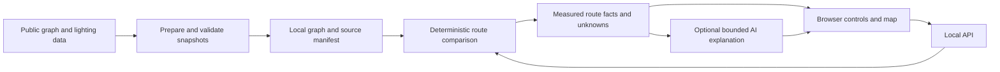

# Design — Ireland After Dark

Proposed implementation specification, 4 October 2026. No application endpoints, modules or algorithms below exist yet. [PRD](PRD.md) owns scope; [data notes](data-sources.md) own observed source facts.

## Architecture

One local Python process serves the API and static browser UI. No database, cloud infrastructure, login system or separate frontend build is needed for the first version.



Suggested stack: FastAPI with Uvicorn; OSMnx/NetworkX for pedestrian graphs; Shapely and a metric projection for geometry; plain HTML/JavaScript and Leaflet. These are proposed defaults, not verified installs. Existing local Python is 3.14; compatibility is a first-milestone check. Preserve it rather than replacing the environment. Use an already-installed compatible interpreter in a separate ignored environment only if necessary; no system installation.

Official references: [FastAPI](https://fastapi.tiangolo.com/tutorial/first-steps/), [OSMnx](https://osmnx.readthedocs.io/en/stable/user-reference.html), [Leaflet](https://leafletjs.com/examples/quick-start/) and [OSM tile policy](https://operations.osmfoundation.org/policies/tiles/). Do not treat documentation availability as proof the full stack runs here.

## Modules and file layout

Proposed files:

```text
src/app.py                 API plus static serving
src/config.py              proposed defaults and supported area
src/data.py                validated snapshot loading and source manifest
src/routing.py             candidate generation and comparison
src/features.py            lighting and optional venue calculations
src/explain.py             deterministic text and optional model adapter
src/static/                HTML, JS, CSS and map assets
scripts/prepare_data.py    explicit public-data preparation
tests/                     synthetic invariants and snapshot integration
data/raw/                  ignored source payloads
data/processed/            ignored graph/features/manifest
```

Keep these as small modules. No agent framework, vector store, microservices or learned crime model. Fetch public data in a preparation step, not on every route request. Never evaluate source text as code or load untrusted pickle files.

## Data preparation contract

Manifest records exact URLs, attribution/licence status, fetch timestamp, content date where known, SHA-256, row/feature counts, area bounds, CRS, validation failures and enabled features. Data payloads stay ignored until redistribution is reviewed. Every developer needs a reproducible preparation command or a clearly labelled permitted snapshot.

Lighting: require numeric, plausible coordinates and supported asset types; report filtered rows. Clip with margin around the graph. Assets may be duplicates or stale: deduplicate by source ID/coordinate without assuming current operation. No nearby record means “no recorded asset within the selected buffer,” not “dark.” If loading fails, return an unavailable feature rather than silently assigning zeros.

Graph: use a small bounding area with margin and a walking network. Keep needed access tags and disconnected components so failures remain visible. Check prohibited/private walking access and route examples, especially crossings, gates and river bridges. OSM walking filters are useful but do not certify all real-world access or closures. Persist a supported non-executable format such as GraphML and record fetch date.

Project graph and assets to a metric CRS; proposed local choice EPSG:2157. Never use degree distances as metres. GeoJSON output uses WGS84 longitude/latitude ordering. Browser map coordinates must be converted deliberately.

OSMnx supports bounding-box walking graphs, metric projection and route candidates; check the pinned API signature before coding. Its 2.x bbox order is left, bottom, right, top. Preserve selected multigraph edge keys: length, geometry and feature calculations must use the same edges.

## Feature calculations

Proposed defaults, subject to inspection:

| Setting | Default | Meaning |
|---|---|---|
| Walking speed | 1.3 m/s | Estimate only; not individual ability or terrain modelling |
| Extra walking allowance | 5 minutes | User-adjustable, proposed range 0–15 |
| Asset proximity buffer | 30 metres | Inventory proximity; not illumination coverage |
| Venue proximity buffer | 30 metres | Mapped venue vicinity; not occupancy or danger |
| Maximum endpoint snap | 100 metres | Reject rather than hide large displacements |
| Candidate count | At most 5 | Keep computation bounded; not exhaustive optimisation |

For each edge geometry, compute the fraction of length intersecting the union of nearby lighting buffers. Clamp to [0,1]; duplicate lamps must not create values above 1. Report route-level proximity as covered length divided by total traversed length. Check cross-river/parallel-road false matches; inventory proximity alone cannot establish useful light on the walkway.

Venues, if enabled: retrieve mapped `amenity=pub` and `amenity=nightclub` in the same area, validate coordinates and source status, and measure affected route length using the same approach. A successful empty query means no mapped venues found; failed/unavailable data is different. No guarantee of exhaustive coverage. Never infer opening hours or current activity from presence.

Footfall is display-only for this build: historical summaries at valid nearby counters. No interpolation across unmeasured roads and no route-wide “isolation” score. Validate station/column mapping and count quality first; do not sum totals plus IN/OUT, or substitute zero for missing values.

## Route algorithm

1. Validate points inside the supported area and snap to eligible pedestrian nodes. Show snap distance; do not draw a supposedly walkable connector through obstacles. Presets should use verified entrances/nodes. Reject identical snapped endpoints explicitly. The first version measures only between verified graph endpoints; unknown approach legs are not included in walking-time claims.
2. Find shortest path by length, retaining its actual edge sequence. Let its graph length be L0.
3. Generate a bounded set: baseline, preference-weighted shortest path, then distance-shortest alternatives up to the candidate limit if needed. Deduplicate edge sequences.
4. Calculate metrics on each actual geometry; reject candidates over `L0 + speed * 60 * extra_minutes` or violating graph/access checks.
5. Choose the lowest preference cost among valid candidates, tie-breaking by length. Always retain baseline for comparison.
6. If no distinct qualifying alternative exists, return an explicit same-route/no-alternative result. It is acceptable for preferences not to change the path.

Proposed nonnegative edge cost:

`length_m * (1 + light_weight * (1 - recorded_asset_fraction) + venue_weight * venue_fraction)`

Weights are preference strengths, not risk probabilities. Suggested light_weight=1 when enabled, otherwise 0; venue_weight=1 when avoidance is enabled and data is available, otherwise 0 with a visible unavailable status. The detour cap is checked on physical length, not weighted cost. Limited candidates do not guarantee a globally optimal constrained route; label the result an alternative among those evaluated. Missing inventory coverage must remain visible even when absence of records affects preference ranking.

## Proposed API contracts

These are application schemas to implement, not claims about external datasets.

- `GET /api/health`: readiness, manifest ID and feature availability; no secrets.
- `GET /api/config`: supported bounds, verified presets, parameter limits and sources.
- `POST /api/routes`: start/end objects with finite numeric lat/lon, max_extra_minutes, prefer_recorded_lighting and avoid_nightlife booleans.
- `POST /api/explain`: optional, accepts an opaque result ID and supported preferences; explanations derive from server-held facts, not arbitrary client claims.

Route response: status (`ok`, `same_route`, `no_alternative`, `baseline_only`); baseline/alternative IDs; GeoJSON LineStrings; graph distance and estimated duration; snap metadata; lighting/venue metrics with availability; source dates/manifest ID; actual detour; explanation mode; warnings. Optional metrics are null with status when unknown. `baseline_only` is partial output, not a preference recommendation. Never emit an incident probability or safety score.

Errors: 422 invalid/out-of-range request; 400 outside area or unverified endpoint; 404 no pedestrian path; 503 required snapshot absent. Graph routes remain available when optional AI fails. Baseline-only comparison is permitted when lighting is unavailable, but it must not be branded as a lighting recommendation. Keep typed error codes and a short useful recovery message.

## AI boundary

Use deterministic explanation first. Once existing model access and permitted calls are confirmed, a single bounded adapter may interpret a small allowlist of preferences or explain computed differences. Do not create keys, buy credits or assume coding-tool login grants application API access.

Pass only necessary computed facts and source metadata; omit user-identifying origin/destination. Inference cannot alter route geometry, invent measurements, certify safety or claim recent incidents. Validate structured output and numeric claims against the server result; fall back to a labelled template on mismatch/timeout. Dataset strings and venue names are untrusted input, never model instructions. Unsupported requests such as “avoid where attacks happened yesterday” receive a clear unsupported explanation.

## Interface and operation

One map, two route styles distinguished by labels and line patterns, compact comparison cards, preference controls, source-details panel and explicit loading/error/unknown states. Use keyboard-operable controls and sufficient contrast; do not rely on red/green to classify danger. Display physical routes, not straight-line geodesics.

Serve UI and API together to avoid CORS/configuration work. Pin frontend assets; follow visible OSM attribution and tile policy, no bulk tile download/offline prefetch. Do not make map tiles a single point of failure: a tested route summary and saved permitted comparison remain useful if tiles fail.

No accounts, analytics, stored travel history or request-body/location logs. Bind development service to localhost. No deployment, public-host exposure or automatic contact workflow. Current code/data execution is untested; completion depends on [the checklist](ACCEPTANCE_CHECKLIST.md).
